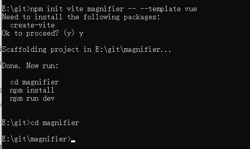
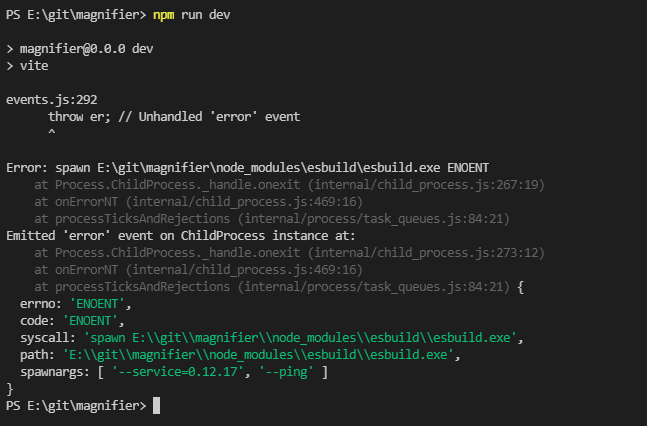

# vue3实现放大镜功能

## 前置

​	作为一名前端er，爱折腾是最核心的属性，所以在这个风和日丽的下午，在上班摸鱼的路上看到了这个：[我要造轮子系列 -Vue3放大镜组件](https://juejin.cn/post/6980724800318603272)。咦，好像很厉害的鸭子。决定了，今天的这个摸鱼时光就干这个了。

<div align="center">
  	
</div>

## 准备
安装vue3相关环境

1. 安装npm环境（ps:可以网上搜索教程）

2. 安装Vue CLI脚手架

   ```bash
   npm install -g @vue/cli
   ```

3. 创建项目并运行

   ```bash
   npm init vite <project-name> -- --template vue
   cd <project-name>
   npm install
   npm run dev
   ```



### 踩坑1：

​	**问题描述**：在创建完项目后进入项目根目录，然后运行`npm run dev`结果就报错了

​	**报错信息**：




**问题分析**：嗯？是按照官网操作来的啊（我一脸懵圈，难道是打开方式不对？？？），然后重新来一遍，还是报错。难道刚刚那里操作有问题，删掉node_modules，重装再来一篇。


**解决办法**：遇事莫慌，百度一波。咦怎么都是进错目录，然后直接进入下一级就行。（这么低级的错误是我这种牛逼的人会犯的吗？）不管了，先回去看一下，嗯，我果然没进错目录。那么再看看其他人怎么说......终于，众人之中，总有小伙伴问题跟我一致了[参考解决](https://blog.csdn.net/qq_36404808/article/details/118672341)，原来是官方问题，还提了issue，先看看怎么个情况。哦哦，跟博客说的差不多，说是应该生成`esbuild/esbuild.exe`文件的,但是不知道为什么就没有生成成功，需要手动生成一下

**结论**：在当前目录下运行`node ./node_modules/esbuild/install.js`即可


